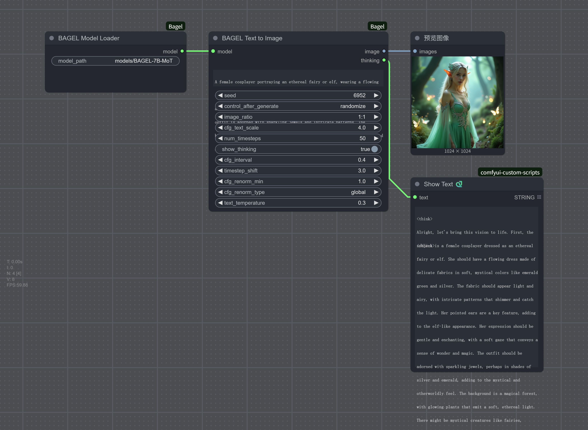
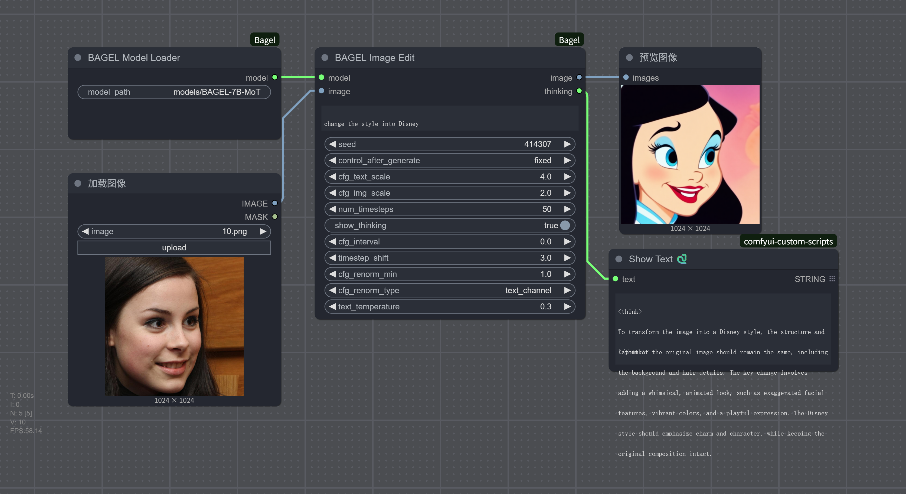
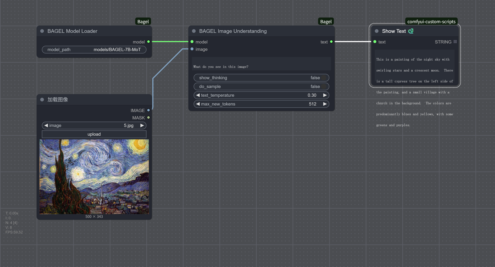

# ComfyUI-Bagel

A ComfyUI custom node package based on the BAGEL-7B-MoT multimodal model.

佬杨同志 @wikeeyang 手撸 node.py 代码,现已支持加载DF11规格模型

1. 需要安装 dfloat11[cuda12] 依赖包。
2. 安装 ComfyUI-BAGEL 插件(已有则不需要重装)。
3. 把原来的 node.py 文件重命名进行备份。
4. 用群里发的 node.py 替换。
5. 启动 ComfyUI，会比原来插件增加了一个 DF11 模型的加载节点，其它不变。

requirements.txt 更新DF11

decord>=0.6.0
einops>=0.8.1
huggingface_hub
matplotlib>=3.7.0
numpy>=1.24.4
opencv_python>=4.7.0.72
pyarrow>=11.0.0
PyYAML>=6.0.2
Requests>=2.32.3
safetensors>=0.4.5
scipy>=1.10.1
sentencepiece>=0.1.99
transformers>=4.51.0
accelerate>=0.34.0
dfloat11[cuda12]
# wandb

## About BAGEL

<p align="center">
  
</p>

BAGEL is an open-source multimodal foundation model with 7B active parameters (14B total) that adopts a Mixture-of-Transformer-Experts (MoT) architecture. It is designed for multimodal understanding and generation tasks, outperforming top-tier open-source VLMs like Qwen2.5-VL and InternVL-2.5 on standard multimodal understanding leaderboards, and delivering text-to-image quality competitive with specialist generators such as SD3.

## Features

- **Text-to-Image Generation**: Generate high-quality images using natural language prompts
- **Image Editing**: Edit existing images based on textual descriptions  
- **Image Understanding**: Perform Q&A and analysis on images
- **Reasoning Process Display**: Optionally display the model's reasoning process

## Installation

### 1. Download Model
The BAGEL-7B-MoT model will be automatically downloaded to `models/bagel/` when first used. You can also manually download it:
```bash
# Clone model using git lfs (recommended)
git lfs install
git clone https://huggingface.co/ByteDance-Seed/BAGEL-7B-MoT models/bagel/BAGEL-7B-MoT

# Or use huggingface_hub
pip install huggingface_hub
python -c "from huggingface_hub import snapshot_download; snapshot_download(repo_id='ByteDance-Seed/BAGEL-7B-MoT', local_dir='models/bagel/BAGEL-7B-MoT')"
```

### 2. Install Dependencies
Install dependencies:
```bash
pip install -r requirements.txt
```

### 3. Restart ComfyUI
Restart ComfyUI to load the new nodes.

## Workflows

### Text-to-Image Generation

Generate high-quality images from text descriptions. Suitable for creative design and content generation.

### Image Editing Workflow

Edit existing images based on textual descriptions, supporting local modifications and style adjustments.

### Image Understanding Workflow

Analyze and answer questions about image content, suitable for content understanding and information extraction.

## Related Links

- [BAGEL Official Paper](https://arxiv.org/abs/2505.14683)
- [BAGEL Model Homepage](https://bagel-ai.org/)
- [Hugging Face Model](https://huggingface.co/ByteDance-Seed/BAGEL-7B-MoT)
- [Online Demo](https://demo.bagel-ai.org/)
- [Discord Community](https://discord.gg/Z836xxzy)

## License

This project is licensed under the Apache 2.0 License. Please refer to the official license terms for the use of the BAGEL model.

## Contribution

Contributions are welcome! Please submit issue reports and feature requests. If you wish to contribute code, please create an issue to discuss your ideas first.
